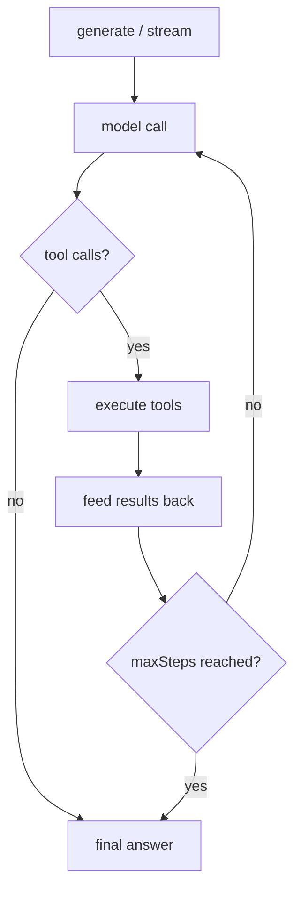

An **agent** is a model, instructions, tools and a memory. You give it a goal; it decides which tools to call, how many times, and when to answer.

- Use an **agent** when the task is open-ended — the steps are not known in advance.
- Use a **[workflow](/docs/reference/workflows)** when the steps are fixed and must be observable/resumable.

Agents are declared in `{tenant.dir}/agents/**/*.agent.ts`, loaded at boot, and reachable from anywhere you have `rest` (routes, services, actions, hooks, workflow steps, lifecycle, scripts) through **`rest.agents`**.

## Quick start

```typescript
// v1/agents/weather.agent.ts
import { define, v } from "@anteros/core";

export default define.Agent({
  id: "weather",
  name: "Weather Agent",
  instructions: "You are a concise weather assistant.",
  provider: {
    model: "gpt-4o-mini",
    compatible: "openai",
    options: { temperature: 0.2, maxTokens: 1000 },
  },
  tools: {
    forecast: define.Tool({
      description: "Current weather for a city",
      inputSchema: v.object({ city: v.string().required() }),
      execute: async ({ city }, { rest }) => ({ city, celsius: 21 }),
    }),
  },
});
```

```typescript
// v1/routes/ask.route.ts — or a service, an action, a workflow step…
const weather = rest.agents.get("weather");

const { text, toolCalls, usage } = await weather.generate("Weather in Paris?");
```

```
{tenant.dir}/agents/
├── weather.agent.ts    # → id "weather"
└── support/
    └── billing.agent.ts # → id "billing" (file name)
```

The `id` is optional: the file name is used when it is omitted. An agent loaded without an `id` **and** without a usable file name is skipped with a log line.

## Provider

The provider is declared inline — there is no SDK to install and no client to keep alive. It carries **the model, the credentials, the endpoint, and how it is called** (`provider.options`).

```typescript
provider: { model: "gpt-4o-mini" }                                            // OpenAI (default)
provider: { model: "claude-sonnet-4-5", compatible: "anthropic" }             // Anthropic
provider: { model: "llama3.1", baseUrl: "http://localhost:11434" }            // Ollama (OpenAI-compatible)
provider: { model: "mixtral-8x7b", baseUrl: "https://api.groq.com/openai/v1" } // any OpenAI-compatible gateway
```

| Option       | Type                      | Default                                                   | Description                         |
| ------------ | ------------------------- | --------------------------------------------------------- | ----------------------------------- |
| `model`      | `string`                  | —                                                         | Model id sent to the API (required) |
| `apiKey`     | `string`                  | environment                                               | API key — see below                 |
| `compatible` | `'openai' \| 'anthropic'` | `'openai'`                                                | Wire protocol                       |
| `baseUrl`    | `string`                  | `https://api.openai.com/v1` / `https://api.anthropic.com` | API root                            |
| `headers`    | `Record<string, string>`  | —                                                         | Extra headers on every request      |
| `options`    | `AgentOptions`            | —                                                         | Sampling and transport — see below  |

**`'openai'` is the default** and covers every OpenAI-compatible gateway (Groq, Mistral, OpenRouter, Ollama, LM Studio, vLLM…). A `baseUrl` with no path gets `/v1` appended (`http://localhost:11434` → `http://localhost:11434/v1`); a `baseUrl` that already has a path is used as-is.

### API key resolution

`apiKey` is optional — the first value found wins:

1. `provider.apiKey`
2. `ANTEROS_AI_API_KEY`
3. `OPENAI_API_KEY` (`compatible: 'openai'`) or `ANTHROPIC_API_KEY` (`compatible: 'anthropic'`)

Keeping the key in the environment is the recommended setup — a key written in a tenant file is a secret in your source tree. When nothing is found, the call fails with `AGENT_PROVIDER_NO_API_KEY` (the definition itself is still valid, so a missing key never breaks the boot).

### Options

Everything that is not the model, the credentials or the endpoint goes into **`provider.options`** — how the model is sampled, and how the HTTP call behaves.

```typescript
define.Agent({
  /* … */
  provider: {
    model: "gpt-4o-mini",
    options: { temperature: 0.2, maxTokens: 1000, retries: 3 },
  },
});
```

| Option        | Type     | Default          | Description                                      |
| ------------- | -------- | ---------------- | ------------------------------------------------ |
| `temperature` | `number` | provider default | Sampling temperature                             |
| `maxTokens`   | `number` | `4096`           | Max tokens generated per model call              |
| `topP`        | `number` | provider default | Nucleus sampling                                 |
| `timeout`     | `number` | `120000`         | Request timeout in ms (`AGENT_PROVIDER_TIMEOUT`) |
| `retries`     | `number` | `2`              | Retries on network errors, `429` and `5xx`       |

They are **per call overridable** and **merged**, not replaced:

```typescript
await agent.generate(input, {
  provider: { options: { temperature: 0 } }, // only temperature changes
  // or together with a model swap:
  provider: { model: "gpt-4o", options: { maxTokens: 500 } },
});
```

The merged result is readable with `agent.getOptions()` / `agent.setOptions({ … })`.

## Tools

A tool has a `description` (say **what it does and when to use it**), an `inputSchema` and an `execute` handler.

```typescript
import { define, v } from "@anteros/core";

export const forecast = define.Tool({
  description:
    "Current weather for a city. Use it whenever the user asks about weather.",
  inputSchema: v.object({
    city: v.string().required().description("City name, e.g. 'Paris'"),
    days: v.number().integer().min(1).max(7).default(1),
  }),
  execute: async (
    { city, days },
    { rest, agent, tenant, toolCallId, signal, error },
  ) => {
    const cached = await rest.vars.get("weather", `forecast:${city}`);
    return cached ?? { city, days, celsius: 21 };
  },
});
```

| Context               | Type                | Description                                         |
| --------------------- | ------------------- | --------------------------------------------------- |
| `rest`                | `Rest`              | The **caller's** client — request-scoped in a route |
| `agent`               | `Agent`             | The agent running the tool                          |
| `tenant`              | `string`            | Tenant of the agent                                 |
| `toolCallId` / `step` | `string` / `number` | Which call, in which model round                    |
| `signal`              | `AbortSignal`       | Aborted when the run is aborted                     |
| `error`               | `fn.error`          | Throw an `AppError` with a stable code              |

The returned value is serialized back to the model: a string is sent as-is, anything else is JSON-serialized. **An error thrown by a tool does not fail the run** — it is reported to the model as `Error: …`, which can then retry or explain. The same applies to unknown tools and invalid arguments (validated before the handler runs).

### Schemas

`inputSchema` accepts a **Joi** schema (the collection field DSL, `v`), a **zod** schema, or a plain **JSON Schema**. Whatever you declare is converted to JSON Schema for the model, and Joi/zod are **enforced** before the handler runs.

### Reusing an MCP tool

A [`define.McpTool`](/docs/reference/mcp) is accepted as an agent tool unchanged — its `exec` is adapted and its `{ content: [{ type: 'text', text }] }` result is flattened to text for the model.

```typescript
import echo from "../mcp/tools/echo.tool";

export default define.Agent({
  /* … */
  tools: { echo },
});
```

## `generate()`

Runs the agent to completion and returns the final answer.

```typescript
const result = await rest.agents.get("weather")!.generate("Weather in Paris?", {
  threadId: "user-42",
  maxSteps: 4,
});
```

| Field          | Type                     | Description                                                            |
| -------------- | ------------------------ | ---------------------------------------------------------------------- |
| `text`         | `string`                 | The final answer                                                       |
| `object`       | `T \| undefined`         | The typed object, when a schema was requested                          |
| `toolCalls`    | `AgentToolCall[]`        | Every call the model made (`id`, `name`, `args`, `argsText`)           |
| `toolResults`  | `AgentToolResultEntry[]` | One entry per call — `result`, or `error` + `durationMs`               |
| `steps`        | `AgentStep[]`            | One entry per model call (text, calls, results, finish reason)         |
| `usage`        | `AgentUsage`             | `inputTokens`, `outputTokens`, `totalTokens`, `requests`               |
| `finishReason` | `string`                 | `stop`, `tool_use`, `length`, `content_filter`, `aborted`, `max_steps` |
| `messages`     | `AgentMessage[]`         | The whole conversation, ready to be persisted                          |

The **tool loop** runs until the model answers without asking for a tool, or until `maxSteps` model calls have been made (default `5`, overridable per agent and per call). A run that stops on the limit ends with `finishReason: 'max_steps'` instead of throwing.



### Per-call options

```typescript
agent.generate(input, {
  threadId: "user-42",          // memory thread
  maxSteps: 6,
  provider: { model: "gpt-4o-mini", options: { temperature: 0, maxTokens: 500 } }, // merged over the declared provider
  instructions: "Answer in one line.",
  tools: { extraTool },         // merged with the agent's own tools
  signal: controller.signal,    // abort -> finishReason 'aborted', partial result
  schema: v.object({ … }),      // structured output
  onStepFinish: (step) => console.log(step.toolCalls),
});
```

## `stream()`

Same run, but the tokens arrive as they are produced.

```typescript
const stream = agent.stream("Weather in Paris?");

for await (const chunk of stream.textStream) {
  process.stdout.write(chunk);
}

console.log(await stream.text); // resolves when the RUN is over
console.log(await stream.toolCalls);
```

| Member                                | Type                              | Description                                          |
| ------------------------------------- | --------------------------------- | ---------------------------------------------------- |
| `textStream`                          | `AsyncIterable<string>`           | Text tokens only                                     |
| `fullStream`                          | `AsyncIterable<AgentStreamChunk>` | `text`, `tool_call`, `tool_result`, `step`, `finish` |
| `text`                                | `Promise<string>`                 | The final text                                       |
| `object`                              | `Promise<T \| undefined>`         | The typed object (schema requested)                  |
| `toolCalls` / `toolResults` / `steps` | `Promise<…[]>`                    | The same data as `generate()`                        |
| `usage` / `finishReason` / `messages` | `Promise<…>`                      | Usage, finish reason, full conversation              |
| `abort()`                             | `(reason?: string) => void`       | Stop the run — the promises resolve with what exists |

::prose-callout{variant="warning"}

The promises resolve when the **whole run** is over — tool rounds included. `await stream.text` is **not** the last token; use `textStream` (or `fullStream`) for that.

::

## Memory

An agent with a `memory` reads the thread before a run and writes the updated conversation after it.

```typescript
type AgentMemory = {
  get(threadId: string): AgentMessage[] | Promise<AgentMessage[]>;
  save(threadId: string, messages: AgentMessage[]): void | Promise<void>;
  clear(threadId: string): void | Promise<void>;
};
```

```typescript
const memory = new agents.memory.InMemory();

export default define.Agent({
  /* … */
  memory,
});
```

```typescript
await weather.generate("hi", { threadId: "user-42" }); // reads + writes
await weather.generate("and in Lyon?", { threadId: "user-42" });
await weather.generate("ignore history", {
  threadId: "user-42",
  memory: { threadId: "user-42", readOnly: true },
});
await weather.clearMessages("user-42");
```

- **`agents.memory.InMemory`** keeps threads in a `Map` — the default. A failed write is logged, never fatal.
- In a multi-process deployment (`reusePort`, several containers) each process has its own `Map`: implement `AgentMemory` on top of `rest.vars`, a collection or Redis for a shared thread.

## Structured output

Declare the shape you want; the answer is parsed, validated, and repaired once if needed.

```typescript
import { v } from "@anteros/core";

const schema = v.object({
  city: v.string().required(),
  celsius: v.number().required(),
});

const { object } = await weather.generate("Weather in Paris?", { schema });
// { city: 'Paris', celsius: 21 }

const object = await weather.generateObject("Weather in Paris?", { schema });
```

The schema is injected into the system prompt and, on OpenAI-compatible providers, `response_format: { type: 'json_object' }` is set. A markdown fence (` ```json `) around the JSON is tolerated.

- **One repair turn** is made when the answer is not valid JSON or fails validation (`temperature: 0`, with the rejection reason in the prompt).
- If it is still invalid the run fails with **`AGENT_OUTPUT_INVALID`** (502) — the raw answer is on `error.reason`.

`generateObject()` throws `AGENT_SCHEMA_REQUIRED` when called without a schema, and `AGENT_OUTPUT_INVALID` when no object could be produced.

## Introspection

```typescript
agent.getId();              // 'weather'
agent.getName();            // 'Weather Agent'
agent.getTenant();          // 'v1'
agent.getModel();           // 'gpt-4o-mini'
agent.getProvider();        // the provider, WITHOUT the apiKey (options included)
agent.getOptions();         // { temperature, maxTokens, topP, timeout, retries } — alias of provider.options
agent.setModel("gpt-4o");   // merge a provider override
agent.setOptions({ temperature: 0 });
agent.setInstructions(…);   // static or dynamic
agent.getTools();           // { forecast: { … } }
agent.hasTool("forecast");  // true
agent.addTool(tool, "name"); // add / replace at runtime
agent.removeTool("name");
agent.toJSON();             // serializable view — never leaks the apiKey
```

## Errors

| Code                        | Status | Raised when                                                             |
| --------------------------- | ------ | ----------------------------------------------------------------------- |
| `AGENT_INVALID`             | 500    | A definition without `instructions` or `provider.model`                 |
| `AGENT_TOOL_INVALID`        | 500    | A tool without `execute`/`exec`, or an unnamed tool in an array         |
| `AGENT_PROVIDER_INVALID`    | 500    | An unknown `compatible`                                                 |
| `AGENT_PROVIDER_NO_API_KEY` | 500    | No key found on the provider or in the environment                      |
| `AGENT_PROVIDER_ERROR`      | 502    | The provider answered `4xx` (never retried) or failed after the retries |
| `AGENT_PROVIDER_TIMEOUT`    | 504    | The request exceeded `timeout`                                          |
| `AGENT_ABORTED`             | 499    | The caller's `signal` aborted the request in flight                     |
| `AGENT_OUTPUT_INVALID`      | 502    | Structured output still invalid after the repair turn                   |
| `AGENT_SCHEMA_REQUIRED`     | 500    | `generateObject()` without a schema                                     |

## Notes and limits

- **Not audited.** A run is not a database operation: only the operations its tools perform go to [`_audit_`](/docs/reference/audit), like any other call. Log what you need explicitly with `rest.audit.log()`.
- **No HTTP endpoint.** Agents are a server-side runtime; expose them from a [route](/docs/reference/routes) or a [service](/docs/reference/services) and keep the access rules you want (understandably, an agent is not a public endpoint by default).
- **Cost is not bounded by the framework.** Every tool round is a paid model call; `maxSteps` and `maxTokens` are the two knobs that bound a run.
- **Tool execution is not retried.** A tool that must not run twice (a payment…) should be idempotent — the framework reports the error to the model instead of replaying it.
- **Reasoning is not observable across processes.** Nothing about a run is persisted by default: pass a `threadId` with a shared `AgentMemory` if a conversation must outlive the process.
