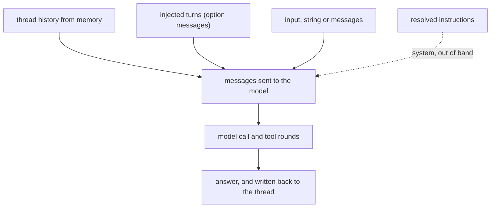
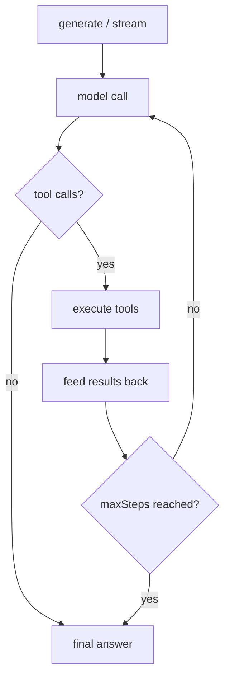

An **agent** is a model, instructions, tools and a memory. You give it a goal; it decides which tools to call, how many times, and when to answer.

- Use an **agent** when the task is open-ended — the steps are not known in advance.
- Use a **[workflow](/docs/reference/workflows)** when the steps are fixed and must be observable/resumable.

Agents are declared in `{tenant.dir}/agents/**/*.agent.ts`, loaded at boot, and reachable from every tenant-scoped context (routes, services, actions, hooks, sockets, scripts, lifecycle, workflow steps, MCP tools) through the **`agents`** member — next to `rest` and `io`.

## Quick start

```typescript
// v1/agents/weather.agent.ts
import { define, v } from "@anteros/core";

export default define.Agent({
  id: "weather",
  description: "Answers weather questions with a live forecast.",
  name: "Weather Agent",
  instructions: "You are a concise weather assistant.",
  provider: {
    model: "gpt-4o-mini",
    compatible: "openai",
    options: { temperature: 0.2, maxTokens: 1000 },
  },
  tools: {
    forecast: define.Tool({
      id: "forecast",
      description: "Current weather for a city",
      inputSchema: v.object({ city: v.string().required() }),
      execute: async ({ city }, { rest }) => ({ city, celsius: 21 }),
    }),
  },
});
```

```typescript
// v1/routes/ask.route.ts — or a service action, a hook, a workflow step…
const weather = agents.get("weather");

const { text, toolCalls, usage } = await weather.generate("Weather in Paris?");
```

```
{tenant.dir}/agents/
├── weather.agent.ts    # → id "weather" (declared)
└── support/
    └── billing.agent.ts # → id "billing" (declared)
```

`id` and `description` are **required** — the id identifies the agent (`agents.get('weather')`, `info`, the HTTP route), the description says what it is for and is served to whoever discovers it. A definition missing either is **refused at load** with a clear message, and the other agents still load.

## Defining an agent

Everything `define.Agent({ … })` accepts:

| Key             | Type                        | Required | What it does                                                                                                                        |
| --------------- | --------------------------- | -------- | ----------------------------------------------------------------------------------------------------------------------------------- |
| `id`            | `string`                    | **yes**  | Unique per tenant. The name used by `agents.get(id)`, the `info` action and the HTTP route                                          |
| `description`   | `string`                    | **yes**  | What the agent is for — served by `info`, read by whoever discovers the agent                                                       |
| `name`          | `string`                    | no       | Human label (defaults to `id`) — `getName()`                                                                                        |
| `instructions`  | `string \| (ctx) => string` | **yes**  | The system prompt. A **function** is resolved before every run — see [dynamic instructions](#where-to-give-the-model-your-docs)     |
| `provider`      | `AgentProvider`             | **yes**  | Model, credentials, endpoint and how it is called — see [Provider](#provider)                                                       |
| `tools`         | `AgentTools`                | no       | A record (or array) of tools — the `id` is the name the model calls. See [Tools](/docs/ai/tools)                                    |
| `memory`        | `AgentMemory`               | no       | Makes the agent stateful: a `thread` replays the conversation. See [Memory](/docs/ai/memory)                                        |
| `maxSteps`      | `number`                    | no       | Max model calls per run (default `5`)                                                                                               |
| `lastMessages`  | `number`                    | no       | Replay only the last N messages of the thread — see [Memory](/docs/ai/memory#history-window)                                        |
| `workingMemory` | `AgentWorkingMemory`        | no       | The scratchpad the agent keeps up to date — see [Working memory](/docs/ai/memory#working-memory)                                    |
| `processors`    | `AgentMemoryProcessor[]`    | no       | Your code around the memory: `load` on what the model sees, `save` on what is stored — see [Processors](/docs/ai/memory#processors) |
| `toolChoice`    | `AgentToolChoice`           | no       | Default tool policy for every run (default `'auto'`)                                                                                |
| `thinking`      | `AgentThinking`             | no       | Default reasoning for every run (default off) — `true`, `'low' \| 'medium' \| 'high'`, `{ budgetTokens }`                           |
| `enabled`       | `boolean`                   | no       | `false` keeps the file without registering it (default `true`)                                                                      |
| `api`           | `{ access, object }`        | no       | Exposes `POST /api/:tenant_id/agents/:id/:action`. **No `api` block = every action denied** — see [HTTP API](#http-api)             |

```typescript
import { define, v, agents } from "@anteros/core";

export default define.Agent({
  id: "support",
  name: "Support",
  description: "Answers support questions, with a durable memory.",

  // Static…
  instructions: "You are a concise support assistant.",
  // …or computed per call (`{ agent, rest, thread, resource }`)
  // instructions: ({ resource }) => `You are helping customer ${resource}.`,

  provider: { model: "gpt-4o-mini", options: { temperature: 0.2 } },

  tools: {/* see Tools */},
  memory: new agents.memory.Mongo({ collection: "support_threads" }),

  maxSteps: 5,
  toolChoice: "auto",
  thinking: "medium", // reasoning default — `generate(…, { thinking: false })` opts out
  lastMessages: 12, // the prompt replays the last 12 messages, the thread keeps them all

  // A profile the model keeps up to date, injected into every prompt
  workingMemory: { template: "# Customer\n- Name:\n- Plan:" },

  api: {
    access: { generate: (ctx) => !!ctx.token.value },
    object: { schema: v.object({ priority: v.string().required() }) },
  },
});
```

- `id` is **not** derived from the file name: `weather.agent.ts` may declare `id: "forecast"`. A duplicate `id` for the same tenant is reported at load (the last file wins).
- A file that **throws on import** is logged and skipped — the other agents (and the other tenants) still load.
- `toolChoice` and `thinking` are **defaults**: a run may override them, and `thinking: false` turns the declared reasoning off for one call.
- `memory`, `workingMemory`, `lastMessages` and `processors` **compose**: the store keeps the threads, the window bounds the prompt, the scratchpad survives the conversation, the processors see both sides. See [Memory](/docs/ai/memory).
- The boot banner reports what was loaded (`Agents: 3`); `agents.stats()` returns the same numbers at runtime (`{ total, tenants }`), and `agents.reload()` re-scans the folder.

## Provider

The provider is declared inline — there is no SDK to install and no client to keep alive. It carries **the model, the credentials, the endpoint, and how it is called** (`provider.options`).

```typescript
provider: { model: "gpt-4o-mini" }                                            // OpenAI (default)
provider: { model: "claude-sonnet-4-5", compatible: "anthropic" }             // Anthropic
provider: { model: "llama3.1", baseUrl: "http://localhost:11434" }            // Ollama (OpenAI-compatible)
provider: { model: "mixtral-8x7b", baseUrl: "https://api.groq.com/openai/v1" } // any OpenAI-compatible gateway
```

| Option       | Type                      | Default                                                   | Description                         |
| ------------ | ------------------------- | --------------------------------------------------------- | ----------------------------------- |
| `model`      | `string`                  | —                                                         | Model id sent to the API (required) |
| `apiKey`     | `string`                  | environment                                               | API key — see below                 |
| `compatible` | `'openai' \| 'anthropic'` | `'openai'`                                                | Wire protocol                       |
| `baseUrl`    | `string`                  | `https://api.openai.com/v1` / `https://api.anthropic.com` | API root                            |
| `headers`    | `Record<string, string>`  | —                                                         | Extra headers on every request      |
| `options`    | `AgentOptions`            | —                                                         | Sampling and transport — see below  |

**`'openai'` is the default** and covers every OpenAI-compatible gateway (Groq, Mistral, OpenRouter, Ollama, LM Studio, vLLM…). A `baseUrl` with no path gets `/v1` appended (`http://localhost:11434` → `http://localhost:11434/v1`); a `baseUrl` that already has a path is used as-is.

### API key resolution

`apiKey` is optional — the first value found wins:

1. `provider.apiKey`
2. `ANTEROS_AI_API_KEY`
3. `OPENAI_API_KEY` (`compatible: 'openai'`) or `ANTHROPIC_API_KEY` (`compatible: 'anthropic'`)

Keeping the key in the environment is the recommended setup — a key written in a tenant file is a secret in your source tree. When nothing is found, the call fails with `AGENT_PROVIDER_NO_API_KEY` (the definition itself is still valid, so a missing key never breaks the boot).

### Options

Everything that is not the model, the credentials or the endpoint goes into **`provider.options`** — how the model is sampled, and how the HTTP call behaves.

```typescript
define.Agent({
  id: "support",
  description: "Answers support questions.",
  /* … */
  provider: {
    model: "gpt-4o-mini",
    options: { temperature: 0.2, maxTokens: 1000, retries: 3 },
  },
});
```

| Option        | Type     | Default          | Description                                      |
| ------------- | -------- | ---------------- | ------------------------------------------------ |
| `temperature` | `number` | provider default | Sampling temperature                             |
| `maxTokens`   | `number` | `4096`           | Max tokens generated per model call              |
| `topP`        | `number` | provider default | Nucleus sampling                                 |
| `timeout`     | `number` | `120000`         | Request timeout in ms (`AGENT_PROVIDER_TIMEOUT`) |
| `retries`     | `number` | `2`              | Retries on network errors, `429` and `5xx`       |

They are **per call overridable** and **merged**, not replaced:

```typescript
await agent.generate(input, {
  provider: { options: { temperature: 0 } }, // only temperature changes
  // or together with a model swap:
  provider: { model: "gpt-4o", options: { maxTokens: 500 } },
});
```

The merged result is readable with `agent.getOptions()` / `agent.setOptions({ … })`.

## Tools

A tool is what the agent can **do** — see the **[Tools](/docs/ai/tools)** page for the schema language, the execution context, what the model gets back and how to control them per run.

```typescript
export default define.Agent({
  /* … */
  tools: {
    forecast: define.Tool({
      id: "forecast",
      description:
        "Current weather for a city. Use it whenever the user asks about weather.",
      inputSchema: v.object({ city: v.string().required() }),
      execute: async ({ city }, { rest }) => ({ city, celsius: 21 }),
    }),
  },
});
```

- A tool has an **`id`** (required — it is the name the model calls, and the record key must match it).
- An `inputSchema` accepts Joi (`v`), zod or a plain JSON Schema — converted for the model, **enforced** before the handler runs.
- A **failing tool does not fail the run**: it is reported to the model as `Error: …`.
- A [`define.McpTool`](/docs/ai/mcp) is accepted as-is (it carries the protocol's `name`).

## `generate()`

Runs the agent to completion and returns the final answer.

```typescript
generate(input: string | AgentMessage[], options?: AgentCallOptions): Promise<AgentGenerateResult>

const result = await agents.get("weather")!.generate("Weather in Paris?", {
  thread: "user-42",
  maxSteps: 4,
});
```

### Input

The first argument is **what to ask**. It has three shapes — accepted identically by `generate()`, `stream()` and `generateObject()` (the `object` action over HTTP and in the SDK):

| Shape            | Use it for                                                                        |
| ---------------- | --------------------------------------------------------------------------------- |
| `string`         | One user turn — the common case                                                   |
| `AgentMessage`   | One turn, with a role                                                             |
| `AgentMessage[]` | A whole conversation: each entry is `{ role, content }` (plus a few extra fields) |

```typescript
await agent.generate("Weather in Paris?");

// The same thing, spelled out — a string is exactly one `user` message
await agent.generate({ role: "user", content: "Weather in Paris?" });

// A conversation: the model sees the turns as context
await agent.generate([
  { role: "user", content: "Weather in Paris?" },
  { role: "assistant", content: "18°C and sunny." },
  { role: "user", content: "And in Lyon?" },
]);
```

Everything is **normalized once, before the call**: the input is validated, folded onto the canonical message shape, and only then sent to the provider and stored in the thread. Nothing is dropped silently — a turn the model could not have seen is refused (`INVALID_INPUT`, 400) rather than ignored.

#### Message roles

| `role`                 | `content`                                       | Extra fields                       |
| ---------------------- | ----------------------------------------------- | ---------------------------------- |
| `user`                 | `string` or [content parts](#content-parts)     | `name?`                            |
| `system` / `developer` | `string` or `text` parts                        | `name?`                            |
| `assistant`            | `string \| null`, or `text` + `tool-call` parts | `toolCalls?`, `thinking?`, `name?` |
| `tool`                 | `string`, or `tool-result` parts                | `toolCallId`, `name`, `isError?`   |

- **`system`** — an **extra** system message: it is appended **after** the resolved `instructions`, it does not replace them.
- **`developer`** — the role OpenAI-compatible endpoints use for an instruction that outranks a user turn. It is sent as such on OpenAI and folded into the **system prompt** on Anthropic (which has no such role).
- **`assistant` + `toolCalls`** — how you replay a stored conversation, or continue a run that stopped on tools. An assistant turn asking for tools must be followed by the matching `tool` turns — that is the shape `result.messages` already has.
- **`tool`** — the answer to one call: `toolCallId` is the `id` of the assistant's call (`AgentToolResultEntry.id`), `name` the tool name, `isError` marks a failure the model should know about.
- **`name`** — a label for the speaker; forwarded to OpenAI (its own `name` field) and dropped on Anthropic, which has nowhere to put it.
- **`thinking`** on an assistant message is kept **raw**, exactly as the provider returned it (signature included) — only useful to replay an Anthropic reasoning turn.

#### Content parts

A message `content` may also be an **array of parts** — the unified vocabulary, the same one other LLM libraries use:

| Part          | Shape                                                                                     | Accepted on                               |
| ------------- | ----------------------------------------------------------------------------------------- | ----------------------------------------- |
| `text`        | `{ type: 'text', text: '…' }`                                                             | any role                                  |
| `image`       | `{ type: 'image', url: 'https://…' }` or `{ type: 'image', data: '<base64>', mimeType? }` | `user`                                    |
| `file`        | `{ type: 'file', name?, url }` or `{ type: 'file', name?, data, mimeType? }`              | `user`                                    |
| `tool-call`   | `{ type: 'tool-call', id, name, arguments }`                                              | `assistant` — becomes `toolCalls`         |
| `tool-result` | `{ type: 'tool-result', id, name?, result? \| error? }`                                   | `tool`, or `user` — becomes a `tool` turn |

```typescript
// An image the endpoint fetches itself, or one you already hold in base64
await agent.generate({
  role: "user",
  content: [
    { type: "text", text: "What is wrong on this screenshot?" },
    { type: "image", url: "https://cdn.example.com/shot.png" },
    { type: "image", data: pngBase64, mimeType: "image/png" },
  ],
});

// A tool round written the way another library emits it — replayed as real turns
await agent.generate([
  { role: "user", content: "Weather in Paris?" },
  {
    role: "assistant",
    content: [
      {
        type: "tool-call",
        id: "call_1",
        name: "forecast",
        arguments: { city: "Paris" },
      },
    ],
  },
  {
    role: "user",
    content: [
      {
        type: "tool-result",
        id: "call_1",
        name: "forecast",
        result: { celsius: 21 },
      },
    ],
  },
  { role: "user", content: [{ type: "text", text: "and in Lyon?" }] },
]);
```

What the framework does with them:

- **`tool-call` → `toolCalls`** on the assistant turn, merged with the calls already declared there; `arguments` (an object) and `argsText` (the raw JSON) are both accepted.
- **`tool-result` → a `tool` turn**, in order: `result` is serialized the way a tool result always is (a string stays as-is, anything else is JSON), `error` becomes `Error: …` with `isError`. A message that is _only_ a tool result does not leave an empty `user` turn behind.
- **A remote `image` stays a URL** — both protocols fetch it themselves, so nothing is downloaded and no size applies.
- **A remote `file` is downloaded and inlined** (10 MB cap, `AGENT_FILE_TOO_LARGE` / `AGENT_FILE_NOT_FOUND`): OpenAI-compatible endpoints only take base64 for a document, so inlining it once keeps `file: { url }` working everywhere.
- Only `https://`, `data:` or base64 is accepted — a `file://` or a relative path is refused (`INVALID_INPUT`). Local paths belong to the [`files` option](#files-images).

This is also what the [`files` option](#files-images) builds for you: prefer it (a path server-side, a `File`/`Blob` from the SDK) unless you already hold base64 — it also reads `.pdf`, `.docx` and `.xlsx` for you.

#### How the input is composed



- **The input is appended last**: a run is `[...history, ...injected, ...input]`. With a `thread`, pass **the new turn only** — passing the whole conversation _and_ a `thread` would replay it twice.
- **`messages` is how you inject turns the thread does not have** — a seed, a history imported from elsewhere, or a turn pair that primes the answer (ending the block on an `assistant` turn is legitimate: the model continues it). Injected turns are sent **and** saved with the rest of the conversation, so they become part of the thread.
- **What you pass is what the model sees.** Beyond `role` and the part shapes there is no validation of the conversation: a broken sequence is the provider's error (Anthropic, for instance, requires roles to alternate — the framework merges consecutive tool results itself).
- **`result.messages`** is `history + input + everything the run produced`. The resolved system prompt is **not** in it: it travels out of band (a `system` message you passed in the input is).
- **Over HTTP** the same shapes travel in the body's `input` field, single message included. Missing/empty → `INPUT_REQUIRED` (400); an unknown role, a part the role cannot carry, a part with no payload → `INVALID_INPUT` (400).

### Result

The result is the answer **and** everything the run did:

| Field          | Type                     | Description                                                            |
| -------------- | ------------------------ | ---------------------------------------------------------------------- |
| `text`         | `string`                 | The final answer                                                       |
| `object`       | `T \| undefined`         | The typed object, when a schema was requested                          |
| `toolCalls`    | `AgentToolCall[]`        | Every call the model made (`id`, `name`, `args`, `argsText`)           |
| `toolResults`  | `AgentToolResultEntry[]` | One entry per call — `result`, or `error` + `durationMs`               |
| `steps`        | `AgentStep[]`            | One entry per model call (text, calls, results, finish reason)         |
| `usage`        | `AgentUsage`             | `inputTokens`, `outputTokens`, `totalTokens`, `requests`               |
| `finishReason` | `string`                 | `stop`, `tool_use`, `length`, `content_filter`, `aborted`, `max_steps` |
| `messages`     | `AgentMessage[]`         | The whole conversation, ready to be persisted                          |

`requests` on `usage` counts the **model calls** (`1 + one per tool round`): a run that used a tool is one request more than a run that answered directly. `steps` holds the same split, one entry per call, with the tools offered at that step.

### The tool loop

The loop runs until the model answers without asking for a tool, or until `maxSteps` model calls have been made (default `5`, overridable per agent and per call). A run that stops on the limit ends with `finishReason: 'max_steps'` instead of throwing.



### Per-call options

Everything `generate()` (and `stream()`, `generateObject()`) accepts — every option is optional:

| Option                         | Type                                                         | Default           | What it does                                                                                              |
| ------------------------------ | ------------------------------------------------------------ | ----------------- | --------------------------------------------------------------------------------------------------------- |
| `thread` / `memory.thread`     | `string`                                                     | —                 | Memory thread to read and write                                                                           |
| `resource` / `memory.resource` | `string`                                                     | —                 | Caller identity — namespaces the thread, feeds dynamic instructions                                       |
| `memory.readOnly`              | `boolean`                                                    | `false`           | Read the thread, write nothing back                                                                       |
| `maxSteps`                     | `number`                                                     | agent's, then `5` | Max model calls for this run                                                                              |
| `lastMessages`                 | `number`                                                     | agent's           | Replay only the last N messages of the thread — a prompt bound, never a write                             |
| `messages`                     | `AgentInput`                                                 | —                 | Turns **injected** into the run — after the thread, before the input (they are saved too)                 |
| `instructions`                 | `string`                                                     | agent's           | Override the system prompt for this run                                                                   |
| `tools`                        | `boolean \| string[] \| AgentTools`                          | `true`            | `true` = all the agent's · `false` = **none** · `['forecast']` = **only these** · `{ … }` = extra, merged |
| `toolChoice`                   | `'auto' \| 'none' \| 'required' \| { name }`                 | `'auto'`          | `'auto'` = the model decides · `'none'` = answer directly · `'required'` / `{ name }` = force a call      |
| `thinking`                     | `boolean \| 'low' \| 'medium' \| 'high' \| { budgetTokens }` | off               | Extended thinking                                                                                         |
| `provider`                     | `Partial<AgentProvider>`                                     | agent's           | Model, endpoint, key — `options` merged key by key (see below)                                            |
| `schema` / `structuredOutput`  | schema                                                       | —                 | Ask for a validated object                                                                                |
| `files` / `filesBaseDir`       | see [Files & images](#files-images)                          | —                 | Images and documents sent with the run                                                                    |
| `signal`                       | `AbortSignal`                                                | —                 | Abort — the partial result is returned, not thrown                                                        |
| `onStepFinish`                 | `(step) => void`                                             | —                 | Called after each model call, before its tools run                                                        |

The `…Id` spellings (`threadId`, `resourceId`, and inside `memory`) are still read as **deprecated aliases** of `thread` / `resource` — both name the same thing, so a mix of the two is fine.

**Sampling and transport are not top-level options** — `temperature`, `maxTokens`, `topP`, `timeout` and `retries` live in `provider.options`, on the definition (`provider: { … options: { temperature: 0.2 } }`) as well as per call. A call's `provider` is merged with the declared one, **`options` key by key**: overriding `temperature` keeps the declared `maxTokens` and `retries`. Read them back with `agent.getOptions()`. Only the server can do this — a client never sends a provider (see [What a client may choose](#what-a-client-may-choose-and-what-it-may-not)).

```typescript
await agent.generate("Answer in one line.", {
  thread: "user-42",
  maxSteps: 6,
  provider: {
    model: "gpt-4o-mini",
    // temperature, maxTokens, topP, timeout, retries — merged with the declaration
    options: { temperature: 0, maxTokens: 500 },
  },
});

// Greedy for one call, everything else as declared
await agent.generate("Classify this.", {
  provider: { options: { temperature: 0 } },
});

await agent.generate("Classify this text.", { tools: false }); // no tool at all
await agent.generate("Weather?", { tools: ["forecast"] }); // only this one
await agent.generate("Weather?", { tools: { extraTool } }); // the agent's own + this one
await agent.generate("Call it.", { toolChoice: "required" });
await agent.generate("Prove it step by step.", { thinking: "high" });
```

::prose-callout{variant="warning"}

`tools: false` is the cheap path (a classification, a rewrite): the definitions are not even sent.
`tools: ['forecast']` gives a session a **subset** without touching the agent's declaration — handy to
hand a read-only set to a caller, or to keep an expensive tool out of a loop. An unknown name in the list
is ignored rather than fatal: what a caller may use legitimately varies.

::

### Thinking

`thinking` turns on extended reasoning, mapped to what each protocol actually has. It is declared once on the agent (`thinking: 'medium'`) and can be overridden per call — `false` switches the declaration off for one run:

| Protocol    | What is sent                                                                                                                                        |
| ----------- | --------------------------------------------------------------------------------------------------------------------------------------------------- |
| `anthropic` | `thinking: { type: 'enabled', budget_tokens }` — a real budget (`'low'` 2 048, `'medium'` 4 096, `'high'` 8 192, or an explicit `{ budgetTokens }`) |
| `openai`    | `reasoning_effort: 'low' \| 'medium' \| 'high'` — no budget knob, so a `{ budgetTokens }` is rounded to the closest level                           |

The reasoning is **never mixed into the answer**: it is available on `result.reasoning`, on
`step.reasoning`, and it streams on its own channel —
`for await (const chunk of stream.fullStream) if (chunk.type === 'reasoning') …`.

Two Anthropic details the framework handles for you: `max_tokens` is **raised** above the budget (the
API refuses `max_tokens <= budget_tokens`), and `temperature` is **omitted** (extended thinking
requires the default). A tool round **echoes the signed reasoning blocks** back, as the API demands —
which is why they travel on the assistant message.

::prose-callout{variant="info"}

Thinking costs tokens twice: the budget is spent on reasoning the customer never sees (Anthropic bills
it as output). Reach for `'medium'` only where the answer really needs it — a tool loop over a simple
lookup does not.

::

## `stream()`

Same run, same [input](#input) and the same options, but the tokens arrive as they are produced.

```typescript
const stream = agent.stream("Weather in Paris?");

for await (const chunk of stream.textStream) {
  process.stdout.write(chunk);
}

console.log(await stream.text); // resolves when the RUN is over
console.log(await stream.toolCalls);
```

| Member                                | Type                              | Description                                          |
| ------------------------------------- | --------------------------------- | ---------------------------------------------------- |
| `textStream`                          | `AsyncIterable<string>`           | Text tokens only                                     |
| `fullStream`                          | `AsyncIterable<AgentStreamChunk>` | `text`, `tool_call`, `tool_result`, `step`, `finish` |
| `text`                                | `Promise<string>`                 | The final text                                       |
| `reasoning`                           | `Promise<string \| undefined>`    | Everything the model thought, when `thinking` is on  |
| `object`                              | `Promise<T \| undefined>`         | The typed object (schema requested)                  |
| `toolCalls` / `toolResults` / `steps` | `Promise<…[]>`                    | The same data as `generate()`                        |
| `usage` / `finishReason` / `messages` | `Promise<…>`                      | Usage, finish reason, full conversation              |
| `abort()`                             | `(reason?: string) => void`       | Stop the run — the promises resolve with what exists |

::prose-callout{variant="warning"}

The promises resolve when the **whole run** is over — tool rounds included. `await stream.text` is **not** the last token; use `textStream` (or `fullStream`) for that.

::

## Memory

An agent with a `memory` reads the thread before a run and writes the updated conversation after it. What it keeps **across** conversations is the working memory, and both are shaped by two options: the window (`lastMessages`) and your own [processors](/docs/ai/memory#processors) — the **[Memory](/docs/ai/memory)** page covers the four pieces, the stores and the trade-offs.

```typescript
type AgentMemory = {
  get(
    threadId: string,
    ctx?: AgentMemoryContext,
  ): AgentMessage[] | Promise<AgentMessage[]>;
  save(
    threadId: string,
    messages: AgentMessage[],
    ctx?: AgentMemoryContext,
  ): void | Promise<void>;
  clear(threadId: string, ctx?: AgentMemoryContext): void | Promise<void>;
  list?(
    ctx?: AgentMemoryContext & { limit?: number },
  ): AgentThread[] | Promise<AgentThread[]>;
};
```

Two implementations ship with the framework — see the **[Memory](/docs/ai/memory)** page for the options, the message cap, the retention and the scoping:

```typescript
const memory = new agents.memory.InMemory({ maxMessages: 40 }); // a Map in the process
const memory = new agents.memory.Mongo({
  collection: "support_threads",
  ttl: "180d",
}); // durable, replicated
const memory = new agents.memory.Redis({ ttl: "7d" }); // shared, no MongoDB involved
```

```typescript
await weather.generate("hi", { thread: "chat-1", resource: "user-42" }); // reads + writes
await weather.generate("and in Lyon?", {
  thread: "chat-1",
  resource: "user-42",
});

// The same, with the `memory` shorthand:
await weather.generate("Remember my favorite color is blue.", {
  memory: { resource: "user-42", thread: "chat-1" },
});

// A preview: read the thread, write nothing back
await weather.generate("ignore history", {
  memory: { thread: "chat-1", resource: "user-42", readOnly: true },
});

await weather.getMessages("chat-1", { resource: "user-42" });
await weather.listThreads({ resource: "user-42" });
await weather.clearMessages("chat-1", { resource: "user-42" });
```

### What writes the thread

Three ways in, and only one of them calls the model:

| How                                | What lands in the thread                                                                                                         | Model call |
| ---------------------------------- | -------------------------------------------------------------------------------------------------------------------------------- | ---------- |
| A run with `thread`                | everything the run saw: the history replayed, **the injected turns**, the input, and every answer and tool turn the run produced | yes        |
| `messages` on a run                | the turns you inject — sent to the model **and** stored, so a seed or an imported history becomes part of the thread             | yes        |
| `agent.remember(thread, messages)` | exactly what you pass, appended to what is already stored                                                                        | **no**     |

```typescript
// Seed a conversation once, then ask questions against it
await weather.remember("chat-1", [
  { role: "user", content: "Hello" },
  { role: "assistant", content: "Hello! How can I help?" },
]);

// Same thing through a run — the injected turns are sent, answered, and kept
await weather.generate("And in Lyon?", {
  thread: "chat-1",
  messages: [
    { role: "user", content: "Weather in Paris?" },
    { role: "assistant", content: "18°C and sunny." },
  ],
});
```

`remember()` is the write-only door: a store replaces a whole thread on `save()`, so it reads the thread, appends and writes it back — the `maxMessages` cap and the caller namespace apply, and an attachment is stored as a note (`[file invoice.pdf]`), exactly like a run. It needs a `memory` (`AGENT_NO_MEMORY`) and returns the stored thread. `messages` on a run follows the same [normalization](/docs/ai/agents#input) as the input, so a `tool-result` part lands as the `tool` turn it means.

- A **failed write is logged, never fatal** — a run keeps its answer.
- The Mongo store creates its collection **on first use**, and the name is **required** — the loader publishes it so the [replication engine](/docs/reference/replication) copies it (`exclude: ['memory']` to opt out).
- `resource` (**`memory.resource`**) **namespaces** the thread (`resource:thread`); it is not an authorization boundary — gate `history`, `threads` and `clear` with `api.access`.
- In a multi-process deployment the `InMemory` store is per process: use `Mongo` or `Redis` for a shared conversation.

## Where to give the model your docs

There is **no dedicated `knowledge` option**: reference material is a tool, like any other capability.

```typescript
// v1/agents/support.agent.ts — the guides are read once, then served on demand
export default define.Agent({
  id: "support",
  description: "Answers support questions from the project guides.",
  instructions:
    "You are the support assistant. Check the guides before answering.",
  provider: { model: "gpt-4o-mini" },
  tools: {
    guide: define.Tool({
      id: "guide",
      description: "Read a support guide by name.",
      inputSchema: v.object({ name: v.string().required() }),
      execute: async ({ name }) => {
        const guides = await loadGuides(); // read at boot, kept in memory
        const guide = guides.find((entry) => entry.name === name);
        return guide ?? { available: guides.map((entry) => entry.name) };
      },
    }),
  },
});
```

That is the whole point of `tools`: a guide lookup, a database query and a payment call have the same shape, so there is one thing to learn — and you keep control of the lookup (a string match, `rest.find`, an external API…):

- **On demand** → a tool, as above.
- **Always in the prompt** → a **dynamic `instructions` function**, resolved before every run:

```typescript
export default define.Agent({
  id: "support",
  description: "Answers support questions with the guide inlined.",
  instructions: async () =>
    [
      "You are the support assistant.",
      await Bun.file("./agents/guides/order-status.md").text(),
    ].join("\n\n"),
  provider: { model: "gpt-4o-mini" },
});
```

::prose-callout{variant="info"}

Injected material costs tokens on **every** run; a tool costs one round trip when it is used. Prefer the tool once your corpus is more than a page or two.

::

## Files & images

A run can carry **attachments** — an image, a PDF, a CSV, a Word or Excel document:

```typescript
// server-side: paths are read when the run happens
await support.generate("What is the total on this invoice?", {
  files: ["./invoices/2026-01.pdf", "./data/sales.csv"],
});

// front-end (SDK): a File from an <input type="file">
await api.agent("support").generate("What is wrong on this screenshot?", {
  files: [input.files[0]],
});
```

A model only understands three things, so every file is resolved to one of them:

| Input                                                                   | What the model receives                               |
| ----------------------------------------------------------------------- | ----------------------------------------------------- |
| `.md` `.txt` `.json` `.csv` `.tsv` `.yaml` `.xml` `.html` `.log`, code… | the **text**, under a header naming the file          |
| `.png` `.jpg` `.jpeg` `.webp` `.gif`                                    | an **image** part (native vision)                     |
| `.pdf`                                                                  | a **document** part (native document input)           |
| `.docx`                                                                 | the **text** extracted from the document              |
| `.xlsx`                                                                 | the **rows**, one CSV block per sheet (`### Sheet 1`) |
| `.doc` `.xls` `.ppt(x)`, anything else                                  | refused with `AGENT_FILE_UNSUPPORTED` and a hint      |

::prose-callout{variant="info"}

`.docx` and `.xlsx` are read **without any dependency**: they are ZIP archives, and the framework opens them itself (`lib/zip.ts`) to pull the text (`word/document.xml`) or the cells (`xl/worksheets/*.xml` + the shared strings) out. What it does not do is the layout, the styles or the embedded objects — enough for a model, not a document renderer.

::

The two guards that matter: a file over **10 MB** is refused (`AGENT_FILE_TOO_LARGE`), and an inlined text is capped at 200 000 characters with an explicit `(truncated)` note. A path that does not exist is a loud `AGENT_FILE_NOT_FOUND` — never a silently dropped attachment.

### What the attachments do to the memory

A thread replays the conversation, so the framework splits the two cases:

- **Text** (CSV, markdown, the text of a `.docx`…) is conversation: it is **stored** and replays on the next turn.
- **Binaries** (image, PDF) are **not stored** — the thread keeps `[image]` / `[file invoice.pdf]` instead, so a store never fills with base64. Send the file again for a follow-up question about it (exactly how a chat UI works).

### Over HTTP

The same thing, base64 (a `File` never crosses the wire as such):

```json
{
  "input": "What is the total on this invoice?",
  "files": [{ "name": "invoice.pdf", "data": "JVBERi0xLjc…" }]
}
```

On the SDK side, encoding is automatic: a `Blob`/`File` becomes `{ name, mimeType, data }`, and `{ name, data, encoding: 'utf8' }` passes text through without base64.

| Code                     | Status | Raised when                                             |
| ------------------------ | ------ | ------------------------------------------------------- |
| `AGENT_FILE_UNSUPPORTED` | 400    | A format no model can read (`.doc`, `.xls`, a tarball…) |
| `AGENT_FILE_NOT_FOUND`   | 400    | A path attachment that does not exist                   |
| `AGENT_FILE_INVALID`     | 400    | A `.docx`/`.xlsx` that is not a readable archive        |
| `AGENT_FILE_TOO_LARGE`   | 413    | Over 10 MB                                              |

## Structured output

Declare the shape you want; the answer is parsed, validated, and repaired once if needed. The [input](#input) is the same as for `generate()` — a `string` or a list of messages.

```typescript
import { v } from "@anteros/core";

const schema = v.object({
  city: v.string().required(),
  celsius: v.number().required(),
});

const { object } = await weather.generate("Weather in Paris?", { schema });
// { city: 'Paris', celsius: 21 }

const object = await weather.generateObject("Weather in Paris?", { schema });
```

The schema is injected into the system prompt and, on OpenAI-compatible providers, `response_format: { type: 'json_object' }` is set. A markdown fence (` ```json `) around the JSON is tolerated.

- **One repair turn** is made when the answer is not valid JSON or fails validation (`temperature: 0`, with the rejection reason in the prompt).
- If it is still invalid the run fails with **`AGENT_OUTPUT_INVALID`** (502) — the raw answer is on `error.reason`.

`generateObject()` throws `AGENT_SCHEMA_REQUIRED` when called without a schema, and `AGENT_OUTPUT_INVALID` when no object could be produced.

## Introspection

```typescript
agent.getId();              // 'weather'
agent.getName();            // 'Weather Agent'
agent.getTenant();          // 'v1'
agent.getModel();           // 'gpt-4o-mini'
agent.getProvider();        // the provider, WITHOUT the apiKey (options included)
agent.getOptions();         // { temperature, maxTokens, topP, timeout, retries }
agent.setModel("gpt-4o");   // merge a provider override
agent.setOptions({ temperature: 0 });
agent.setInstructions(…);   // static or dynamic
agent.getTools();           // { forecast: { … } }
agent.hasTool("forecast");  // true
agent.addTool(tool);           // add or replace (the tool carries its id)
agent.getMessages(thread, { resource? }); // the stored thread — see Memory
agent.remember(thread, messages);      // append to it, no model call
agent.listThreads({ resource?, limit? });   // a caller's threads
agent.getWorkingMemory({ resource? });      // the scratchpad — see Memory
agent.setWorkingMemory(value, { resource? }); // write it, no model call
agent.removeTool("name");
agent.toJSON();             // serializable view — never leaks the apiKey
```

## Where to use an agent

`rest`, `api` and `agents` sit in the context of every tenant-scoped execution point: **`agents` is the canonical path**, next to `rest` and `io` — and `api`, the facade that groups `rest` the way the SDK does ([Internal API → The `api` facade](/docs/manage-data/internal-api#the-api-facade)). The tenant is implicit and the registry is bound to the _calling_ client, so the agent's tools run with the right scope (the request's, in a route).

| Where               | Context                                                                           | Get an agent            |
| ------------------- | --------------------------------------------------------------------------------- | ----------------------- |
| Route               | `{ c, rest, agents, api, jwt, io }`                                               | `agents.get('support')` |
| Service action      | `{ rest, agents, api, data, token, jwt, error, io }`                              | `agents.get('support')` |
| Collection hook     | `{ rest, agents, api, action, meta, io }`                                         | `agents.get('support')` |
| Collection action   | `{ rest, agents, api, data, io, error, jwt, token }`                              | `agents.get('support')` |
| Socket handler      | `{ io, socket, rest, agents, api }`                                               | `agents.get('support')` |
| Script              | `{ rest, agents, api, tenant, progress? }`                                        | `agents.get('support')` |
| Lifecycle           | `{ tenant, rest, agents, api, logger, cfg, replication }` (+ `io` in `afterBoot`) | `agents.get('support')` |
| Workflow step       | `{ data, prevOutput, rest, agents, api, error, jwt }`                             | `agents.get('support')` |
| MCP tool / resource | `{ c, rest, agents, api, args }`                                                  | `agents.get('support')` |

```typescript
// v1/services/support.service.ts
export default define.Service({
  name: "support",
  enabled: true,
  actions: {
    ask: async ({ agents, data, error }) => {
      const support = agents.get("support");
      if (!support) throw error("Agent unavailable", { status: 503 });
      // `thread` continues a conversation, `resource` namespaces it per caller
      return support.generate(data.question, {
        thread: data.thread,
        resource: data.user,
      });
    },
  },
});
```

Every hook receives it too — calling an agent from a hook needs nothing but the context:

```typescript
// v1/hooks/orders.hook.ts
export default define.Hook(async ({ agents, meta }) => {
  if (meta.action !== "insertOne") return;
  await agents
    .get("triage")
    ?.generate(`Classify: ${JSON.stringify(meta.data)}`);
});
```

### Outside a context

When there is no context at all — module scope, a global middleware, your own `Bun.serve`, a `Bun.cron` — import the registry and pass the tenant:

```typescript
import { agents } from "@anteros/core";

const support = agents.get("v1", "support"); // Agent | undefined
await support.generate("Where is my order?");

agents.ids("v1"); // ['support', …]
agents.list("v1");
agents.has("v1", "support");
agents.stats(); // { total, tenants } — the boot banner
await agents.reload(); // re-scan {tenant.dir}/agents

// No `rest` bound: pass one so the tools can query the database
agents.get("v1", "support", rest);
```

::prose-callout{variant="warning"}

`agents.get(id)` returns a **copy** of the agent bound to your `rest` — the registry instance is shared by every caller, and binding it in place would leak one request's client (and its Mongo session, hence its transaction) into another. A copy shares the declaration: instructions, tools, **memory** (so a thread stays continuous across calls) and any runtime tweak.

::

## HTTP API

An agent becomes reachable over HTTP as soon as it declares an `api` block — same shape as the [services API](/docs/reference/services), same access model (**[`api.access`](/docs/reference/access-control), no rules = denied**).

```
POST /api/:tenant_id/agents/:agent_id/:action
```

```typescript
// v1/agents/support.agent.ts
export default define.Agent({
  id: "support",
  description: "Answers support questions over HTTP.",
  /* … */
  api: {
    access: {
      info: true, // public metadata
      generate: (ctx) => !!ctx.token.value, // any authenticated caller
      stream: (ctx) => !!ctx.token.value,
      history: (ctx) => ctx.token.decoded?.sub === ctx.thread, // your own thread
      threads: (ctx) => !!ctx.token.value,
      clear: (ctx) => ctx.token.decoded?.role === "admin",
    },
    object: { schema: v.object({ priority: v.string().required() }) },
  },
});
```

| Action     | Input                   | Returns                                                                                                                                           |
| ---------- | ----------------------- | ------------------------------------------------------------------------------------------------------------------------------------------------- |
| `info`     | —                       | `{ agent: { id, name, description, tenant, provider, instructions, tools, maxSteps, toolChoice, thinking, memory } }` — no model call, no API key |
| `generate` | `{ input }`             | `{ text, reasoning?, toolCalls, toolResults, steps, usage, finishReason }`                                                                        |
| `stream`   | `{ input }`             | **SSE** — the runtime chunks, then `{ type: 'done', result }`                                                                                     |
| `object`   | `{ input }`             | `{ …generate, object }` — requires `api.object`                                                                                                   |
| `history`  | `{ thread, resource? }` | `{ messages }` — requires a `memory`                                                                                                              |
| `threads`  | `{ resource?, limit? }` | `{ threads }` — requires a store that lists ([Memory](/docs/ai/memory))                                                                           |
| `clear`    | `{ thread, resource? }` | `{ ok: true }` — requires a `memory`                                                                                                              |

`input` is the same value the in-process call takes — a string (one user turn), **one** message, or an **array** of messages (see [Input](#input) for the roles, the content parts and the exact shape). Every run action — **`generate`, `stream` and `object` alike** — also accepts `thread`, `resource`, `maxSteps`, `lastMessages`, `messages`, `files` and `readOnly`. The `…Id` spellings (`threadId`, `resourceId`) are accepted as deprecated aliases.

::prose-callout{variant="info"}

What a client may choose is deliberately **narrower than the in-process options**: the provider, `instructions`, `tools`, `toolChoice` and `thinking` stay server-side — a caller can lower `maxSteps` and `lastMessages`, never raise them past the declaration. `messages` injects turns for the run (sent **and** stored); `input` alone already expresses any conversation, so `messages` is the convenience, not the only door.

::

```bash
curl -X POST localhost:4000/api/v1/agents/support/generate \
  -H 'Content-Type: application/json' \
  -H 'Authorization: Bearer <jwt>' \
  -d '{ "input": "Where is my order?", "thread": "user-42" }'
```

### Access rules

`api.access` follows the framework rules exactly ([access control](/docs/reference/access-control)):

- **No rule = denied** — an agent with no `api`, or no rule for the action called, is refused (`ACCESS_DENIED`).
- `true` → public, no token needed. `false` → denied.
- A **function** requires a valid, non-expired token; it receives `{ rest, agent, action, body, input, thread, error, jwt, token }` — the input is available, so a rule can decide on the payload itself.
- `'*'` applies to every action.

### What a client may choose — and what it may not

A request can set the **input**, a **memory thread**, a **`resource`** and a **lower `maxSteps`**. Everything else stays server-side:

- the **provider** (model, endpoint, key) — changing it is a deployment decision, and a client can never spend on another model or point the agent elsewhere;
- the **options** (temperature, maxTokens…) — the declared ones apply;
- the **structured-output schema** — declared under `api.object`, never sent by a client, so the answer is really validated;
- `maxSteps` is **clamped** to the declared ceiling (`Math.min`): a caller can bound a run tighter, never wider.

### Streaming format

The `stream` action answers `text/event-stream`, one event per runtime chunk, then a final `done`:

```
data: {"type":"text","text":"Bon"}

data: {"type":"tool_call","toolCall":{"id":"call_1","name":"forecast","args":{"city":"Paris"}}}

data: {"type":"tool_result","toolResult":{…}}

data: {"type":"step","step":{…}}

data: {"type":"finish","finishReason":"stop","usage":{…}}

data: {"type":"done","result":{ "text":"…", "toolCalls":[…], "usage":{…}, "finishReason":"stop" }}
```

A failure mid-run is sent as `{ type: 'error', message, code }` — the status code is already 200 by then, so the error travels in the stream.

When the client disconnects, the run is **aborted** (`finishReason: 'aborted'`) instead of continuing to burn tokens: the request signal is handed to the agent.

### Audit

The call is recorded in [`_audit_`](/docs/reference/audit) as `action: 'agent.generate' | 'agent.stream' | …` with `collection: '_agents_:<id>'` (the same convention as `_vars_:<namespace>`):

```json
{
  "action": "agent.generate",
  "collection": "_agents_:support",
  "status": "success",
  "input": {
    "agent": "support",
    "thread": "user-42",
    "text": "Where is my order?"
  },
  "result": {
    "finishReason": "stop",
    "usage": { "requests": 2, "totalTokens": 26 },
    "tools": ["forecast"],
    "steps": 2
  }
}
```

- The **answer is never stored** (`result` keeps the envelope: finish reason, usage, tool **names**, step count), and the tool **arguments are never stored** either.
- The prompt **is** stored (it is the call's parameter) — capped at 2000 characters, redacted like any other payload; a longer one is truncated with `truncated: true` and its real `length`.
- A refused call is recorded too, with `status: 'error'` and the access code.

## JavaScript SDK

The [SDK](/docs/manage-data/sdk) mirrors the API on `api.agent(id)` — one bound client per agent, tenant already known. `agent(id)` is shared by **both** SDK clients; the example uses `Anteros`, the recommended one. The first argument is the same [input](#input): a `string` or an array of messages.

```typescript
import { Anteros } from "@anteros/sdk";

const api = new Anteros({ server: "http://localhost:4000", tenant: "v1" });
const support = api.agent("support");

const info = await support.info();

const { text, toolCalls, usage } = await support.generate(
  "Where is my order?",
  {
    thread: "chat-1", // memory thread
    resource: "user-42", // caller identity
    maxSteps: 3, // lower the ceiling
  },
);

const priority = await support.object("Triage this ticket", {
  thread: "user-42",
});

const messages = await support.history("user-42");
const threads = await support.threads({ resource: "user-42" });
await support.clear("user-42");
```

Streaming yields the server events as they arrive:

```typescript
const stream = await support.stream("And in Lyon?", { thread: "user-42" });

for await (const token of stream.textStream) process.stdout.write(token);

// …or every event, tool calls included
for await (const chunk of stream.fullStream) {
  if (chunk.type === "tool_call") console.log("→", chunk.toolCall.name);
}

console.log(await stream.text); // resolves when the run is over
console.log(await stream.reasoning); // when the agent declares `thinking`
console.log((await stream.usage).requests);
stream.abort(); // stop: the server aborts its model call too
```

`generate()`, `stream()` and `object()` take the **same** `AgentRunOptions` — `thread`, `resource`, `maxSteps`, `lastMessages`, `messages`, `files`, `memory` — through one shared body builder, so a run behaves the same whichever door it came through.

The `abort()` promise rejects with an `AbortError` (`code: 'AGENT_STREAM_ABORTED'`) while `textStream` simply ends. `stream()` itself throws on a `401` or an unknown agent — the errors arrive **before** any token is read.

## Errors

| Code                        | Status | Raised when                                                             |
| --------------------------- | ------ | ----------------------------------------------------------------------- |
| `AGENT_INVALID`             | 500    | A definition without `instructions` or `provider.model`                 |
| `AGENT_TOOL_INVALID`        | 500    | A tool without `execute`/`exec`, or an unnamed tool in an array         |
| `AGENT_PROVIDER_INVALID`    | 500    | An unknown `compatible`                                                 |
| `AGENT_PROVIDER_NO_API_KEY` | 500    | No key found on the provider or in the environment                      |
| `AGENT_PROVIDER_ERROR`      | 502    | The provider answered `4xx` (never retried) or failed after the retries |
| `AGENT_PROVIDER_TIMEOUT`    | 504    | The request exceeded `timeout`                                          |
| `AGENT_ABORTED`             | 499    | The caller's `signal` aborted the request in flight                     |
| `AGENT_OUTPUT_INVALID`      | 502    | Structured output still invalid after the repair turn                   |
| `AGENT_SCHEMA_REQUIRED`     | 500    | `generateObject()` without a schema                                     |

### HTTP API

| Code                               | Status | Raised when                                                        |
| ---------------------------------- | ------ | ------------------------------------------------------------------ |
| `ACCESS_DENIED`                    | 401    | No `api` block, no rule for the action, or the rule returned false |
| `AUTH_REQUIRED` / `TOKEN_EXPIRED`  | 401    | A function rule without a valid token                              |
| `AGENT_NOT_FOUND`                  | 400    | Unknown agent id for the tenant                                    |
| `INPUT_REQUIRED` / `INVALID_INPUT` | 400    | Missing `input`, empty array, or a message without `role`          |
| `INVALID_JSON_BODY`                | 400    | A JSON body that does not parse                                    |
| `THREAD_ID_REQUIRED`               | 400    | `history` / `clear` without `thread`                               |
| `AGENT_NO_MEMORY`                  | 400    | `history` / `threads` / `clear` on an agent without `memory`       |
| `AGENT_MEMORY_NO_LIST`             | 400    | `threads` on a store without `list`                                |
| `AGENT_MEMORY_NO_REST`             | 500    | A Mongo store used outside a context (no `rest`)                   |
| `AGENT_NO_OBJECT_SCHEMA`           | 400    | `object` without `api.object`                                      |
| `ACTION_NOT_FOUND`                 | 400    | An unreachable action name                                         |

## Notes and limits

- **Not audited as a run.** Only the operations the tools perform are audited like any other call — plus, when the [HTTP API](#http-api) is used, one entry per call (`agent.generate`, …) with the prompt and the envelope. From a route or a service, log what you need explicitly with `rest.audit.log()`.
- **Expose it deliberately.** A route or a service is a public endpoint by default: an agent is a paid, unbounded computation, so gate it with [`api.access`](#access-rules) — or keep it server-side and never declare an `api` block at all.
- **Cost is not bounded by the framework.** Every tool round is a paid model call; `maxSteps` and `maxTokens` are the two knobs that bound a run.
- **Tool execution is not retried.** A tool that must not run twice (a payment…) should be idempotent — the framework reports the error to the model instead of replaying it.
- **Reasoning is not observable across processes.** Nothing about a run is persisted by default: pass a `thread` with a shared `AgentMemory` if a conversation must outlive the process.
