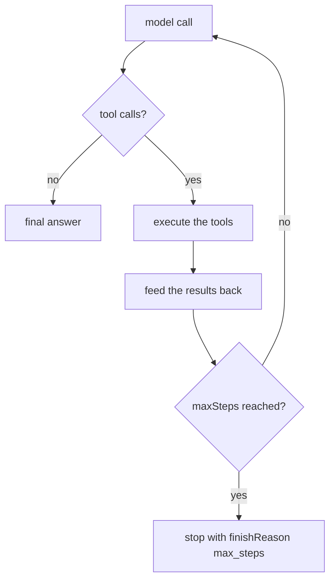

A tool is what an agent can **do**: call an API, query a collection, run a calculation. The model decides when to call one, with which arguments, and how many times — until it can answer.

```typescript
// v1/agents/support.agent.ts
import { define, v } from "@anteros/core";

export default define.Agent({
  id: "support",
  description: "Answers support questions with a live forecast.",
  instructions: "You are the support assistant.",
  provider: { model: "gpt-4o-mini" },
  tools: {
    forecast: define.Tool({
      id: "forecast",
      description:
        "Current weather for a city. Use it whenever the user asks about weather.",
      inputSchema: v.object({
        city: v.string().required().description("City name, e.g. 'Paris'"),
        days: v.number().integer().min(1).max(7).default(1),
      }),
      execute: async ({ city, days }, { rest }) => {
        const cached = await rest.vars.get("weather", `forecast:${city}`);
        return cached ?? { city, days, celsius: 21 };
      },
    }),
  },
});
```

The **`id`** (`forecast`) is the name the model calls — and the key in the record must be that same id. It is **required**: an unnamed tool cannot be called.

## Writing a good tool

| Piece         | What it is for                                                                                                              |
| ------------- | --------------------------------------------------------------------------------------------------------------------------- |
| `description` | **The whole prompt for that tool.** Say what it does _and when to use it_ — that is what makes the model pick the right one |
| `inputSchema` | The arguments — Joi (`v`), zod or a plain JSON Schema                                                                       |
| `execute`     | The handler — the only place side effects happen                                                                            |

- Describe the **arguments** too (`v.string().description("City name, e.g. 'Paris'")`): a `city` field with no description gets `{"city": "the city of the user"}`.
- Return **small, factual results**. The model pays for every token you return, on every round.
- A tool that changes something should be **idempotent**: a run is a loop, and a step can be retried.

## The execution context

```typescript
execute: async (input, { rest, agent, tenant, toolCallId, step, signal, error }) => { … }
```

| Context               | Type                | Description                                                                                        |
| --------------------- | ------------------- | -------------------------------------------------------------------------------------------------- |
| `rest`                | `Rest`              | The **caller's** client — request-scoped in a route, so a tool runs with the request's permissions |
| `agent`               | `Agent`             | The agent running the tool                                                                         |
| `tenant`              | `string`            | Tenant of the agent                                                                                |
| `toolCallId` / `step` | `string` / `number` | Which call, in which model round                                                                   |
| `signal`              | `AbortSignal`       | Aborted when the run is aborted (or the client disconnects)                                        |
| `error`               | `fn.error`          | Throw an `AppError` with a stable code                                                             |

## Schemas

`inputSchema` accepts **Joi** (the collection field DSL, `v`), a **zod** schema, or a plain **JSON Schema**. Whatever you declare is converted to JSON Schema for the model, and Joi/zod are **enforced** before the handler runs — a wrong argument never reaches your code.

```typescript
inputSchema: z.object({ city: z.string() });            // zod
inputSchema: { type: "object", properties: { … } };      // raw JSON Schema (passthrough, not enforced)
```

::prose-callout{variant="warning"}

An undeclared `inputSchema` becomes an **open object**: the model will guess. Declaring the shape is what keeps a tool call (and the bill) predictable.

::

## What the model gets back

- A **string** is sent as-is.
- Anything else is **JSON-serialized**.
- An MCP tool result (`{ content: [{ type: 'text', text }] }`) is **flattened to its text**.
- A **failing tool does not fail the run**: a thrown error, invalid arguments and an unknown tool are all reported to the model as `Error: …`, which can then retry, correct itself, or explain.

```typescript
execute: async ({ id }, { rest, error }) => {
  const order = await rest.findOne("orders", id);
  if (!order)
    throw error(`No order '${id}'`, { status: 404, code: "ORDER_NOT_FOUND" });
  return { status: order.status, total: order.total }; // the model sees the JSON
};
```

## Reusing an MCP tool

A [`define.McpTool`](/docs/ai/mcp) is accepted as an agent tool unchanged — its `exec` is adapted, its arguments validated, and its result flattened to text:

```typescript
import echo from "../mcp/tools/echo.tool";

export default define.Agent({
  id: "support",
  description: "Answers support questions, with the MCP echo tool.",
  /* … */
  tools: { echo },
});
```

## Controlling tools per run

The tools an agent declares are its baseline; a single call can change that without touching the declaration — see [`tools`](/docs/ai/agents#per-call-options):

```typescript
await agent.generate("Classify this text.", { tools: false }); // no tool at all
await agent.generate("Weather?", { tools: ["forecast"] }); // only this one
await agent.generate("Weather?", { tools: { extraTool } }); // the agent's own + this one
await agent.generate("Call the tool.", { toolChoice: "required" });
```

| `tools`                | The run sees                                 |
| ---------------------- | -------------------------------------------- |
| `true` (default)       | every tool the agent declares                |
| `false`                | **none** — the definitions are not even sent |
| `['forecast', 'echo']` | **only these** (an unknown name is ignored)  |
| `{ … }` / `[{ … }]`    | extra tools, **merged** with the agent's own |

`toolChoice` is a different question — _how_ the model may use them: `'auto'` (default), `'none'` (answer directly, tools still advertised), `'required'` (must call one), `{ name: 'forecast' }` (must call that one).

## Choosing the tools

The framework **does not pick tools**: everything a run allows is sent, and the model chooses. What varies is what a run allows — `tools` (which definitions) and `toolChoice` (how it may use them) — never a ranking done on your behalf.

```typescript
// Forty tools declared, none of them sent for this call
await agent.generate("Classify this text.", { tools: false });

// A subset, without touching the declaration
await agent.generate("Weather?", { tools: ["forecast", "geocode"] });
```

| `toolChoice`                          | What happens                                             |
| ------------------------------------- | -------------------------------------------------------- |
| `'auto'` _(default)_                  | the model decides freely among the tools of the run      |
| `'none'`                              | it must answer directly (the tools are still advertised) |
| `'required'` / `{ name: 'forecast' }` | it must call a tool, or that specific one                |

`'auto'` is a real value, not just the default: an agent declaring `toolChoice: { name: 'forecast' }` can be **released** for one call with `{ toolChoice: 'auto' }`.

### Keeping the list small

With forty tools declared, sending all of them on every round is slower, more expensive **and** less accurate — the model reads forty descriptions to pick one. The lever is the declaration, not a hidden search:

- **Split the agent.** One agent per job (`support`, `billing`) with the five tools that job needs beats one agent with every tool; a [service](/docs/reference/services) decides which one to call.
- **Send a subset per call** — `tools: ['forecast']` for a branch of your code that knows what it is doing.
- **Describe the selection in the prompt**: `instructions` can tell the model which family of tools to consider for the current caller (`resource` is available in a dynamic function).
- **Name the tools well**: the `description` is the only thing the model has to choose — see [Writing a good tool](#writing-a-good-tool).

If you need real semantic narrowing (embeddings over hundreds of tools), it belongs **in your application**, not in the runtime: pick the ids with the search you already have and pass them as `tools: [...]` — the run then sends exactly those, and `result.steps[0].tools` records what was sent.

## At runtime

```typescript
agent.getTools(); // { forecast: { … } }
agent.hasTool("forecast"); // true
agent.addTool(tool); // add or replace, without redeploying a definition
agent.removeTool("name");
```

## The loop

Tools are called inside a **loop** bounded by `maxSteps` (default 5, per agent or per call):



A run that stops on the limit does not throw: `finishReason` is `'max_steps'`, and the last answer is returned with it. Every round is a **paid model call** — `maxSteps` is the knob that bounds a run.
