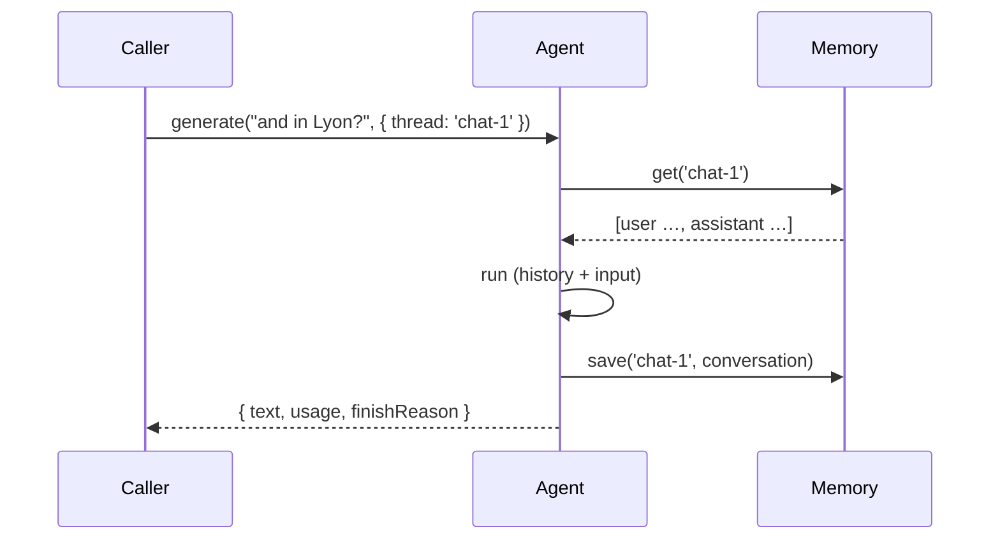

An agent without a memory is **stateless**: every run starts from your `input`, and nothing it answered is remembered. Give it a `memory` and the framework replays the conversation:



The agent **reads the thread before the run** and **writes the updated conversation after it** — including the tool calls and their results, so a resumed thread stays coherent.

## Declaring a memory

```typescript
// v1/agents/support.agent.ts
import { define, v, agents } from "@anteros/core";

export default define.Agent({
  id: "support",
  description: "Answers support questions, with a durable memory.",
  instructions: "You are a concise support assistant.",
  provider: { model: "gpt-4o-mini" },
  // The store keeps the threads; the agent only reads and writes them.
  memory: new agents.memory.Mongo({
    collection: "support_threads",
    maxMessages: 60,
    ttl: "180d",
  }),
  tools: {/* … */},
});
```

Four things a memory does, and they compose — take the ones you need:

| Piece              | What it gives the model                                                   | Section                           |
| ------------------ | ------------------------------------------------------------------------- | --------------------------------- |
| **Threads**        | the recent conversation, replayed on every run                            | [below](#declaring-a-memory)      |
| **Working memory** | a durable scratchpad it keeps up to date (a profile, the state of a task) | [Working memory](#working-memory) |
| **History window** | a bound on the prompt — the last N messages, whatever the store keeps     | [`lastMessages`](#history-window) |
| **Processors**     | your own transformation of what it sees, and of what is stored            | [Processors](#processors)         |

Then a run is threaded by passing a `thread` — every call with the same value continues the same conversation:

```typescript
await support.generate("Where is my order?", {
  thread: "chat-1",
  resource: "user-42",
});
await support.generate("And when will it arrive?", {
  thread: "chat-1",
  resource: "user-42",
});
```

Or with the `memory` shorthand — same thing, one object:

```typescript
await support.generate("Remember my favorite color is blue.", {
  memory: {
    resource: "user-123",
    thread: "conversation-123",
  },
});
```

| Call option                                    | Effect                                                                                            |
| ---------------------------------------------- | ------------------------------------------------------------------------------------------------- |
| `thread` / `memory.thread`                     | The thread to read and write                                                                      |
| `resource` / `memory.resource`                 | Opaque caller identity — **namespaces** the thread and is forwarded to your instructions function |
| `memory: { thread, resource, readOnly: true }` | Reads the thread, writes nothing back (a preview, an A/B test)                                    |

`memory` wins over the flat options (`memory.thread` beats `thread`). The deprecated `…Id` spellings (`threadId`, `resourceId`, and inside `memory`) are still read as aliases — both name the same thing. The same names are accepted by `getMessages()`, `clearMessages()`, `listThreads()` and the [HTTP API](/docs/ai/agents#http-api).

No `memory` on the definition → `thread` is ignored, and the agent stays stateless.

## Writing a thread

A run **replaces** the whole thread at the end: a store receives `history + input + everything the run produced`, so nothing is lost and nothing has to be merged by hand. Two things follow:

- whatever you send is what gets stored — including the turns you **inject** with the `messages` option, which land after the thread history and before the question;
- `memory: { readOnly: true }` skips the write entirely (a preview).

```typescript
// The injected turns are sent AND kept: a seed, or a history imported from elsewhere
await support.generate("And in Lyon?", {
  thread: "chat-1",
  resource: "user-42",
  messages: [
    { role: "user", content: "Weather in Paris?" },
    { role: "assistant", content: "18°C and sunny." },
  ],
});
```

When there is **no run to hang a write on** — seeding a thread, importing a transcript, persisting what an operator decided outside the agent — use `agent.remember()`: it appends to the stored thread **without calling the model**.

```typescript
const thread = await support.remember(
  "chat-1",
  [
    { role: "user", content: "Hello" },
    { role: "assistant", content: "Hello! How can I help?" },
  ],
  { resource: "user-42" },
); // → the whole thread, as it now is
```

It applies the same rules as a run: the caller namespace (`resource`), the `maxMessages` cap, and the same normalization as the input — an attachment becomes a note (`[file invoice.pdf]`), a `tool-result` part becomes the `tool` turn it means. A write-only door, no token spent; an agent without a `memory` refuses with `AGENT_NO_MEMORY`. Unlike a run — where a failed write is only logged (see the store contract below) — a failing `remember()` throws: the caller asked for that write.

## Working memory

History replays a conversation. **Working memory is what should survive it**: the profile of a caller, the state of a task — a short block the model keeps up to date, injected into every prompt rather than replayed from the transcript.

```typescript
export default define.Agent({
  id: "support",
  description: "Answers support questions, remembering the customer.",
  instructions: "You are a concise support assistant.",
  provider: { model: "gpt-4o-mini" },
  memory: new agents.memory.Mongo({ collection: "support_threads" }),
  workingMemory: {
    template: "# Customer\n- Name:\n- Company:\n- Plan:\n- Open issues:",
  },
});
```

A run then carries this in its system prompt:

```text
## Working memory

# Customer
- Name: Sam
- Company: Acme
- Plan: pro
- Open issues: invoice #421 disputed

Keep it up to date with the `updateWorkingMemory` tool: record what is durable,
remove what is no longer true, and never store secrets.
```

### Two shapes

|                   | `template`                     | `schema`                           |
| ----------------- | ------------------------------ | ---------------------------------- |
| Stored as         | a markdown block               | a validated JSON object            |
| An update         | **replaces** the block         | **merges** the patch               |
| Reach for it when | a profile, a scratchpad, prose | typed data you also read from code |

With a **schema** (Joi, zod, plain JSON Schema), the tool takes a **partial** object — every field optional — and the update is a deep merge: an object merges key by key, a `null` **removes** a key, an array **replaces** the array. A patch that breaks the schema is reported to the model as a tool error and nothing is written; the run goes on.

```typescript
workingMemory: {
  schema: v.object({
    name: v.string(),
    timezone: v.string(),
    goals: v.array().items(v.string()),
  }),
},
```

One of the two, not both — a definition with neither (or both) is refused at load (`AGENT_WORKING_MEMORY_INVALID`).

### Scope

| `scope`                  | One scratchpad per…                  | Use it for                                            |
| ------------------------ | ------------------------------------ | ----------------------------------------------------- |
| `'resource'` _(default)_ | caller, across **all** their threads | a user profile                                        |
| `'thread'`               | conversation                         | a task state that must not leak between conversations |

A `'resource'` scope needs `resource` at call time; `'thread'` needs `thread`. Without the id it needs, the run simply has no working memory — no error, no block.

### Reading and writing it from your code

```typescript
await support.getWorkingMemory({ resource: "user-42" }); // the block, or undefined
await support.setWorkingMemory("# Customer\n- Name: Sam", {
  resource: "user-42",
});
await support.clearWorkingMemory({ resource: "user-42" });
```

`setWorkingMemory()` never calls the model, and applies the same rule as the tool (replace for a template, validated merge for a schema). An agent without a `memory` says `AGENT_NO_MEMORY`, one without a `workingMemory` declaration says `AGENT_WORKING_MEMORY_DISABLED`, a store that cannot keep a scratchpad says `AGENT_WORKING_MEMORY_UNSUPPORTED`.

::prose-callout{variant="info"}

**Reading a scratchpad is not authorization.** `resource` is sent by whoever calls: gate the routes that expose `getWorkingMemory()` the way you gate any other read. Two agents sharing one store **share** the scratchpad — which is usually what you want (a support and a billing agent agreeing on the same customer); give them separate collections to isolate them.

::

### Where it lives

- **Mongo** — a second collection, derived from the one you named: `collection: 'support_threads'` also writes `support_threads__state`, one document per scope key. Both are published to the [replication engine](/docs/reference/replication) like a declared collection (`replication.exclude: ['memory']` covers both).
- **Redis** — `<prefix>:<tenant>:state:<key>`, no expiry: a profile must outlive the conversation that created it.
- **InMemory** — a `Map` alongside the threads, per process.

### What to know

- **The block is built once per run**: a tool round inside the same run still sees the prompt it started with. The next run reads the new value.
- **Narrowing `tools` removes the update tool** — `tools: false` and `tools: ['forecast']` leave the model unable to write (the block is still injected). A tool **you** declare under the id `updateWorkingMemory` wins over the generated one.
- **`memory: { readOnly: true }`** injects the block and exposes no tool.
- Keep templates **short and consistently cased** (`## Personal info`, `- Name:`): they are forms the model fills in, and a long one is truncated like any other context.

## History window

The store decides what a thread **keeps** (`maxMessages`); the window decides what a run **replays**:

```typescript
lastMessages: (6, // on the definition
  await agent.generate("…", { lastMessages: 3 })); // or per call
```

The window applies **after** the store read and **before** the prompt, so:

- the thread keeps everything — a window is a prompt decision, never a write (`remember()` and `getMessages()` still see it all);
- the oldest messages leave the prompt and stay available through your own queries;
- the opens of the prompt stop moving every turn, which is what keeps a provider **prompt cache** warm.

Count is a proxy for size: a tool round stores several messages. There is no token-budget window — use a smaller `lastMessages`, or a [`save` processor](#processors) that trims by tokens.

## Processors

A processor is your code at the two moments a memory matters — the same idea as a Mastra memory processor, with one list instead of two:

```typescript
export default define.Agent({
  /* … */
  processors: [
    {
      id: "redact",
      // What the MODEL will see (after the thread, the injection and the input)
      load: (messages) =>
        messages.map((message) => ({
          ...message,
          content: String(message.content).replace(
            /\b\d{4}-\d{4}-\d{4}-\d{4}\b/g,
            "****",
          ),
        })),
    },
    {
      id: "keep-it-short",
      // What is STORED (before the cap, before the attachments become notes)
      save: (messages) => messages.slice(-40),
    },
  ],
});
```

| Hook   | Runs                                       | Sees                                                   | Returning nothing               | Throwing                                         |
| ------ | ------------------------------------------ | ------------------------------------------------------ | ------------------------------- | ------------------------------------------------ |
| `load` | after the thread is read, before the model | history (windowed), injected turns, input, attachments | leaves the messages as they are | fails the run                                    |
| `save` | after the run, before the store write      | the whole thread, including what this run produced     | leaves the messages as they are | **nothing is stored** — the answer still returns |

They run in declaration order, each one receiving what the previous returned. A throwing `save` is the guardrail: the conversation never reaches the store, and the caller still gets the answer (the skip is logged).

### Semantic recall belongs here

The framework ships **no embedder and no vector database** — that is a deliberate boundary, not a gap: a vector store is a deployment choice with a cost, a latency and a data-residency question of its own. What memory gives you is the two seams to build it on: your own store (search it with whatever you already run) and `load`.

```typescript
processors: [{
  id: "recall",
  // 1. embed the question  2. search your own index  3. put the hits back in the prompt
  load: async (messages, ctx) => {
    const question = String(messages.at(-1)?.content ?? "");
    const hits = await searchMyVectorStore(question, { limit: 4, thread: ctx?.resourceId });
    if (!hits.length) return messages;

    return [
      { role: "system", content: `Relevant past exchanges:\n${hits.map((h) => h.text).join("\n")}` },
      ...messages,
    ];
  },
}],
```

Indexing is the other half, and it is just as direct: index in `save` (the conversation that is about to be stored), or from `remember()` if your transcript arrives from elsewhere. The `embed` endpoint can be anything OpenAI-compatible — Ollama or a hosted model — called with `fetch`, exactly like a [provider](/docs/ai/agents#provider).

## The store contract

A memory is any object with three methods — implement it on a database of your own, on S3, or on a third-party API:

```typescript
type AgentMemory = {
  get(
    threadId: string,
    ctx?: AgentMemoryContext,
  ): Promise<AgentMessage[]> | AgentMessage[];
  save(
    threadId: string,
    messages: AgentMessage[],
    ctx?: AgentMemoryContext,
  ): Promise<void> | void;
  clear(threadId: string, ctx?: AgentMemoryContext): Promise<void> | void;
  /** Optional — a caller's threads, most recent first. */
  list?(
    ctx?: AgentMemoryContext & { limit?: number },
  ): Promise<AgentThread[]> | AgentThread[];
  /** Optional — a durable scratchpad (`workingMemory`, one entry per scope key). */
  getState?(
    key: string,
    ctx?: AgentMemoryContext,
  ): Promise<AgentMemoryState | undefined> | AgentMemoryState | undefined;
  setState?(
    key: string,
    value: AgentMemoryState,
    ctx?: AgentMemoryContext,
  ): Promise<void> | void;
  clearState?(key: string, ctx?: AgentMemoryContext): Promise<void> | void;
};
```

A store that omits `getState`/`setState` simply makes `workingMemory` inert — a custom store does not have to implement it.

`ctx` is what the run knows about itself — `{ agentId, tenant, rest, resourceId }`. A store that ignores it (like `InMemory`) stays perfectly valid; a Mongo-backed one uses `ctx.rest` to reach the tenant database. `ctx.resourceId` is the **store-side** name of the run's `resource` option; the same goes for the positional `threadId` of the three methods — the store works with identifiers, the caller writes `thread` / `resource`.

Failed writes are **logged, never fatal**: an answer the model produced is worth more than a thread we could not persist. A failing `get` (an unreachable Redis…) is a different story — it propagates, because answering from a truncated history would be worse.

## `agents.memory.InMemory`

A `Map` in the process — the store to reach for in a script, a test or a demo:

```typescript
const memory = new agents.memory.InMemory({ maxMessages: 40 });
```

Each process has its own threads: in a multi-process deployment (`reusePort`, several containers) two requests on the same thread can miss each other's messages. Use `Mongo` (durable, with the rest of your data) or `Redis` (shared, without MongoDB) instead.

## `agents.memory.Redis`

Shared by every process, **without any MongoDB involvement** — the right store when the conversations are operational state rather than records you back up:

```typescript
memory: new agents.memory.Redis({ url: Bun.env.REDIS_URL, ttl: "7d" });
```

| Option                       | Type                           | Default                                        | Description                                                             |
| ---------------------------- | ------------------------------ | ---------------------------------------------- | ----------------------------------------------------------------------- |
| `client`                     | `RedisClientLike`              | —                                              | An existing client (`ioredis` satisfies it) — the store never closes it |
| `url`                        | `string`                       | `REDIS_URL`, then `localhost:6379`             | `redis://` connection string                                            |
| `host` / `port` / `password` | `string` / `number` / `string` | `REDIS_HOST` / `REDIS_PORT` / `REDIS_PASSWORD` | Used when `url` is absent                                               |
| `prefix`                     | `string`                       | `anteros:agent-memory`                         | Key namespace                                                           |
| `maxMessages`                | `number`                       | `100`                                          | Same hard cap as the other stores                                       |
| `ttl`                        | `string \| false`              | —                                              | Expiry of a thread (`'7d'`), **refreshed on every save**                |
| `scoped`                     | `boolean`                      | `true`                                         | Namespace each thread under its `resourceId`                            |

```
anteros:agent-memory:<tenant>:thread:<resourceId>:<threadId>   → JSON
anteros:agent-memory:<tenant>:resource:<resourceId>            → ZSET (score = updatedAt)
```

- The **tenant is part of every key** — unlike `Mongo`, whose database is already per tenant. A store built once at module scope can serve several tenants, and it **refuses to run without one** (`AGENT_MEMORY_NO_TENANT`) rather than putting everyone in the same bucket.
- The caller index (a sorted set) is what `list()` walks. It expires on the same `ttl` as the threads, and a member whose thread is gone is **pruned on read** — an index that outlives its threads never grows forever.
- `ioredis` is connected **lazily**: defining the agent does not open a socket. `close()` releases the client when the store owns it.
- A corrupted entry is read as an empty thread (and logged) — a broken value never breaks a run.

::prose-callout{variant="info"}

Redis is **outside Mongo**, so it is outside the [replication engine](/docs/reference/replication): nothing is copied to your destinations, and `clear()` needs no tombstone. If conversations must survive a disaster, use `Mongo` (replicated by default) or your Redis persistence/backup.

::

## `agents.memory.Mongo`

Durable, shared by every process — **one document per thread in a collection you name**:

```typescript
memory: new agents.memory.Mongo({
  collection: "support_threads",
  maxMessages: 60,
  ttl: "180d",
});
```

| Option        | Type              | Default | Description                                                                                 |
| ------------- | ----------------- | ------- | ------------------------------------------------------------------------------------------- |
| `collection`  | `string`          | —       | **Required** — the collection holding the threads, in the tenant database                   |
| `maxMessages` | `number`          | `100`   | Messages kept per thread — a hard cap (see below)                                           |
| `ttl`         | `string \| false` | —       | Retention on `updatedAt` (`'180d'`); `false` disables it, omitted keeps the threads forever |
| `scoped`      | `boolean`         | `true`  | Namespace each thread under its `resourceId`                                                |

::prose-callout{variant="info"}

**The collection name is yours to choose** — `_memories_`, `support_threads`, one collection per agent… There is no default: the threads are your data, they belong where you decide. The name is picked when the agent is loaded, so the [replication engine](/docs/reference/replication) copies that exact collection (see below), and the store creates it — with its indexes — **on first use**, never at boot.

::

```json
{
  "_id": "user-42:chat-1",
  "threadId": "chat-1",
  "resourceId": "user-42",
  "agentId": "support",
  "title": "Where is my order?",
  "messages": [
    { "role": "user", "content": "…" },
    { "role": "assistant", "content": "…" }
  ],
  "createdAt": "2026-01-01T09:00:00.000Z",
  "updatedAt": "2026-01-01T09:02:11.000Z"
}
```

- **Nothing is created at boot.** The collection and its indexes (`{ resourceId: 1, updatedAt: -1 }`, plus the TTL when configured) are ensured on first use.
- **The working memory lives next to the threads** — a second collection named after this one (`support_threads` → `support_threads__state`), one document per scope key (`{ value, createdAt, updatedAt }`). No TTL there: a profile is not a conversation.
- **Replicated by default** — the loader publishes the collections of every agent's store (`cfg.agentMemories`, threads **and** state), so the [replication engine](/docs/reference/replication) copies them like declared collections; `replication.exclude: ['memory']` keeps every conversation on the source. A **cleared thread propagates its deletion** (the store writes the tombstone the framework uses elsewhere). See the notes below for the retention caveat.
- **`title`** is derived from the first user message and written once — it belongs to the first exchange, not to the last.
- The store needs a `rest`: resolve the agent from a context (`agents.get('support')`) or hand one over (`agents.get('v1', 'support', rest)`), otherwise the call fails with `AGENT_MEMORY_NO_REST`.

## Bounding a conversation

A thread that grows forever eventually blows the context window — and the bill. `maxMessages` is a **hard cap**: on every save the oldest messages are dropped, except that the **opening `system` message keeps a slot** (a persona defined in the conversation is not the first thing you want to lose).

```typescript
new agents.memory.Mongo({ collection: "support_threads", maxMessages: 3 });

// [system, user:1, assistant:2, user:3, assistant:4]
// → kept: [system, user:3, assistant:4]
```

Two things to know:

- Trimming is **blind**: the oldest turns vanish. If the beginning of a conversation matters (a decision, an identifier), have your instructions carry it — or write a store that summarizes instead of truncating.
- The bound is applied **per save**, not per request: a long run (many tool rounds) still sends everything it built during that run.

## Retention

`ttl` is the same option on both shared stores — a duration string, or `false` to opt out explicitly:

```typescript
new agents.memory.Mongo({ collection: "support_threads", ttl: "180d" }); // MongoDB TTL index on `updatedAt`
new agents.memory.Mongo({ collection: "support_threads", ttl: false }); // explicitly no retention
new agents.memory.Mongo({ collection: "support_threads" }); // untouched: threads are kept forever

new agents.memory.Redis({ ttl: "7d" }); // EXPIRE on the thread and its caller index
```

Retention follows _activity_, not creation: the expiry is refreshed on every `save()`, so a thread you keep coming back to never ages out. The vocabulary matches the [audit](/docs/reference/audit#retention) and [workflow](/docs/reference/workflows) retention (`'180d'`, `'24h'`…).

## Threads and callers

With `scoped` (the default), the document key is `resource:thread`:

```typescript
await support.generate("hi", { thread: "chat-1", resource: "user-42" }); // → _id "user-42:chat-1"
await support.generate("hi", { thread: "chat-1", resource: "user-43" }); // → _id "user-43:chat-1"
```

::prose-callout{variant="warning"}

Scoping is **namespacing, not authorization**. `resource` is sent by the caller: it keeps two callers from colliding on a shared `thread`, but it does not stop a client from reading someone else's thread. Gate `history`, `threads` and `clear` with [`api.access`](/docs/ai/agents#access-rules) — the rule receives the token and the thread.

::

Listing a caller's threads (a sidebar in a chat UI):

```typescript
const threads = await agent.listThreads({ resource: "user-42", limit: 20 });
// [{ threadId: 'chat-1', title: 'Where is my order?', messages: 12, updatedAt: Date }]
```

`listThreads()` returns `[]` for a store without `list` (a custom one that only reads and writes).

## Over HTTP and with the SDK

The memory actions are part of the [agents HTTP API](/docs/ai/agents#http-api) — and of the SDK:

| Action    | Body                    | Returns                                  |
| --------- | ----------------------- | ---------------------------------------- |
| `history` | `{ thread, resource? }` | `{ messages }`                           |
| `threads` | `{ resource?, limit? }` | `{ threads }` — needs a store that lists |
| `clear`   | `{ thread, resource? }` | `{ ok: true }`                           |

Every one of them also accepts the shorthand — `memory: { thread, resource }` (and `readOnly: true` on a run, to read a thread without writing the exchange back):

```typescript
const support = api.agent("support");
const memory = { resource: "user-42", thread: "chat-1" };

await support.generate("Where is my order?", { memory });
const messages = await support.history("chat-1", { memory });
const threads = await support.threads({ memory });
await support.clear("chat-1", { memory });
```

::prose-callout{variant="info"}

A thread created with a `resource` must be read back with the **same** `resource` — the key is `resource:thread`, so `history` without it looks for a thread that does not exist. Send it on every action of a thread.

::

## A custom store

Anything with `get` / `save` / `clear` works — a collection of your own, Redis, or a service you already run:

```typescript
class RedisMemory implements AgentMemory {
  constructor(private url: string) {}

  async get(threadId: string, ctx?: AgentMemoryContext) {
    const raw = await fetch(
      `${this.url}/threads/${ctx?.resourceId ?? "-"}:${threadId}`,
    ).then((r) => r.json());
    return (raw?.messages ?? []) as AgentMessage[];
  }

  async save(
    threadId: string,
    messages: AgentMessage[],
    ctx?: AgentMemoryContext,
  ) {
    await fetch(`${this.url}/threads/${ctx?.resourceId ?? "-"}:${threadId}`, {
      method: "PUT",
      body: JSON.stringify({ messages: messages.slice(-40) }),
    });
  }

  async clear(threadId: string, ctx?: AgentMemoryContext) {
    await fetch(`${this.url}/threads/${ctx?.resourceId ?? "-"}:${threadId}`, {
      method: "DELETE",
    });
  }
}
```

## Notes and limits

- **Replicated by default.** The Mongo store publishes the collection it writes to, and the [replication engine](/docs/reference/replication) copies it — conversations reach your destinations unless you opt out:

```typescript
replication: { destinations: [...], exclude: ['memory'] }   // keep conversations on the source
```

The opt-out is the **`memory` name**, whatever you called the collection. A **cleared thread is deleted on the destination too**: the store writes the same tombstone the framework uses elsewhere, so a `clear()` follows the data instead of leaving an orphan. One consequence worth knowing: an `agents.memory.Mongo({ ttl })` retention is a **store** option, so the destination is _not_ pruned the same way (the engine only mirrors the audit and workflow retentions).

- **Only what is loaded.** The engine knows the memory collections of the agents it loaded from `{tenant.dir}/agents` — a store created ad hoc (a script, a test) is not published, and its collection is not replicated unless you declare it as a collection.

- **Not semantic.** `maxMessages` truncates; it does not summarize, and the framework ships no vector search. That is what [`load` processors](#semantic-recall-belongs-here) are for: recall from an index you control, put the hits back in the prompt. Nothing is asked of you until you ask for it — and a memory that fits in the window needs none of it.
- **The window bounds the prompt, never the store** — `lastMessages` is a read-side decision, so a trimmed prompt never loses data (`remember()` and your own queries still see everything).
- **Pick the store per need.** `InMemory` for a script or a test, `Mongo` when the conversation is part of your data (durable, replicated, prunable by TTL), `Redis` when it is shared operational state with an expiry. The three share the same options and the same contract, so switching is a one-line change.
- **Not shared with the `InMemory` store** across processes — that is the point of `Mongo` and `Redis`.
- **No cross-agent threads.** A thread belongs to the agent that wrote it: two agents sharing a `thread` overwrite each other's document (`agentId` is recorded to make that visible).
